# Drag-and-Drop Modeling with PlantUML Embedding - Design Document

## Overview

This document outlines a comprehensive approach to enable drag-and-drop-style modeling using PlantUML's embedding capabilities. The system will create individual PlantUML diagrams for each element, then compose them into larger diagrams using PlantUML's `!include` directive.

## Core Concept

### Single Element Diagrams
- Each element gets its own PlantUML diagram file
- Stored as reusable components
- Can include element properties, relationships, and metadata
- Named using element ID or sanitized element name

### Composite Diagrams
- Larger diagrams that embed single-element diagrams using `!include`
- Support visual layout and positioning
- Maintain relationships between embedded elements
- Enable drag-and-drop manipulation through UI

## Architecture

### 1. Database Schema Extensions

#### New Table: `element_diagrams`
```sql
CREATE TABLE IF NOT EXISTS element_diagrams (
    id INTEGER PRIMARY KEY AUTOINCREMENT,
    element_id INTEGER NOT NULL UNIQUE,
    plantuml_code TEXT NOT NULL,
    encoded_url TEXT,
    layout_x INTEGER DEFAULT 0,
    layout_y INTEGER DEFAULT 0,
    width INTEGER DEFAULT 200,
    height INTEGER DEFAULT 150,
    created_at TIMESTAMP DEFAULT CURRENT_TIMESTAMP,
    updated_at TIMESTAMP DEFAULT CURRENT_TIMESTAMP,
    FOREIGN KEY (element_id) REFERENCES domainmodel(id)
)
```

#### Enhanced Table: `plantumldiagrams`
Add new columns:
```sql
ALTER TABLE plantumldiagrams ADD COLUMN diagram_type TEXT DEFAULT 'composite';
ALTER TABLE plantumldiagrams ADD COLUMN layout_data TEXT; -- JSON for element positions
ALTER TABLE plantumldiagrams ADD COLUMN uses_embedding BOOLEAN DEFAULT 0;
```

#### New Table: `composite_diagram_elements`
```sql
CREATE TABLE IF NOT EXISTS composite_diagram_elements (
    id INTEGER PRIMARY KEY AUTOINCREMENT,
    diagram_id INTEGER NOT NULL,
    element_id INTEGER NOT NULL,
    layout_x INTEGER DEFAULT 0,
    layout_y INTEGER DEFAULT 0,
    z_index INTEGER DEFAULT 0,
    visible BOOLEAN DEFAULT 1,
    created_at TIMESTAMP DEFAULT CURRENT_TIMESTAMP,
    FOREIGN KEY (diagram_id) REFERENCES plantumldiagrams(id),
    FOREIGN KEY (element_id) REFERENCES domainmodel(id),
    UNIQUE(diagram_id, element_id)
)
```

### 2. PlantUML Embedding Strategy

#### Single Element Diagram Format

```plantuml
@startuml element_<element_id>
!include <edgy/edgy>
top to bottom direction

' Element definition
$capability("ElementName")
note right of ElementName
    Description here
end note

@enduml
```


#### Composite Diagram Format
```plantuml
@startuml composite_<diagram_id>
!include <edgy/edgy>
top to bottom direction

' Include individual element diagrams
!includeurl http://localhost:5000/api/elements/<element_id>/diagram
!includeurl http://localhost:5000/api/elements/<element_id>/diagram

' Define relationships between embedded elements
$link(Element1, Element2, "relates")

@enduml
```

**Alternative Approach (File-based includes):**
Since PlantUML server may not support dynamic URLs, we can:
1. Generate element diagrams on-demand
2. Store them as files or encoded strings
3. Use `!include <file>` or embed code directly

**Recommended: Direct Code Embedding**
```plantuml
@startuml composite_<diagram_id>
!include <edgy/edgy>
top to bottom direction

' Embed element 1 code directly
!define ELEMENT1_START
$capability("CustomerPortal")
note right of CustomerPortal
    Customer-facing portal
end note
!define ELEMENT1_END
!ELEMENT1_START

' Embed element 2 code directly
!define ELEMENT2_START
$capability("PaymentGateway")
note right of PaymentGateway
    Payment processing
end note
!define ELEMENT2_END
!ELEMENT2_START

' Relationships
$link(CustomerPortal, PaymentGateway, "uses")

@enduml
```

## API Endpoints

### Element Diagram Management

#### 1. Generate/Get Single Element Diagram
```
GET /api/elements/<element_id>/diagram
POST /api/elements/<element_id>/diagram/regenerate
```
**Response:**
```json
{
    "element_id": 123,
    "plantuml_code": "@startuml...",
    "encoded_url": "...",
    "element": {
        "id": 123,
        "name": "CustomerPortal",
        "element": "capability",
        "facet": "Architecture"
    }
}
```

#### 2. Create/Update Composite Diagram
```
POST /api/diagrams/composite
PUT /api/diagrams/composite/<diagram_id>
```
**Request:**
```json
{
    "title": "Architecture Overview",
    "element_ids": [123, 456, 789],
    "layout_data": {
        "123": {"x": 100, "y": 100},
        "456": {"x": 400, "y": 100},
        "789": {"x": 250, "y": 300}
    },
    "relationships": [
        {"source": 123, "target": 456, "type": "uses"}
    ]
}
```

#### 3. Add/Remove Element from Composite
```
POST /api/diagrams/<diagram_id>/elements
DELETE /api/diagrams/<diagram_id>/elements/<element_id>
PUT /api/diagrams/<diagram_id>/elements/<element_id>/position
```

#### 4. Get Diagram Layout
```
GET /api/diagrams/<diagram_id>/layout
```

## Frontend UI Components

### 1. Element Palette
- List of all available elements
- Filterable by facet, enterprise, element type
- Draggable element cards
- Visual preview of element diagrams

### 2. Diagram Canvas
- Interactive SVG/Canvas area
- Drop zones for elements
- Visual relationship connectors
- Zoom/pan controls
- Grid/snap-to-grid option

### 3. Element Manipulation
- Click to select element
- Drag to reposition
- Resize handles
- Context menu (properties, delete, duplicate)
- Visual feedback (hover, selected states)

### 4. Relationship Creation
- Click source element, then target element
- Visual connector line
- Relationship type selector
- Edit/delete relationships

### 5. Diagram Toolbar
- Save diagram
- Export (PNG, SVG, PlantUML code)
- Undo/Redo
- Zoom controls
- Layout algorithms (auto-arrange)
- Toggle element details

## Chatbot Integration

### New Chatbot Commands

#### 1. Create Element Diagram
```
User: "Create a diagram for CustomerPortal"
Bot: Creates single-element diagram, shows preview
```

#### 2. Add Element to Diagram
```
User: "Add PaymentGateway to the current diagram"
Bot: Adds element to composite, updates layout
```

#### 3. Create Composite Diagram
```
User: "Create a diagram showing all Architecture capabilities"
Bot: Creates composite with all Architecture elements
```

#### 4. Modify Diagram Layout
```
User: "Move CustomerPortal to the top left"
Bot: Updates element position in composite
```

#### 5. Add Relationship
```
User: "Connect CustomerPortal to PaymentGateway with 'uses' relationship"
Bot: Adds relationship, updates PlantUML code
```

#### 6. Remove Element
```
User: "Remove PaymentGateway from the diagram"
Bot: Removes element and related relationships
```

### Chatbot Response Format

```json
{
    "type": "diagram_action",
    "action": "add_element|remove_element|create_diagram|update_layout|add_relationship",
    "diagram_id": 123,
    "element_id": 456,
    "plantuml_code": "...",
    "preview_url": "...",
    "message": "Added CustomerPortal to diagram"
}
```

## Implementation Phases

### Phase 1: Single Element Diagrams
1. Create `element_diagrams` table
2. Implement element diagram generation endpoint
3. Generate PlantUML code for individual elements
4. Store and retrieve element diagrams

### Phase 2: Composite Diagram Infrastructure
1. Extend `plantumldiagrams` table
2. Create `composite_diagram_elements` table
3. Implement composite diagram generation
4. Support embedding element diagrams

### Phase 3: Basic UI
1. Element palette component
2. Diagram canvas (basic)
3. Add/remove elements
4. Display composite diagram

### Phase 4: Drag-and-Drop
1. Implement drag handlers
2. Drop zones and positioning
3. Visual feedback
4. Save layout data

### Phase 5: Relationship Management
1. Visual relationship creation
2. Relationship editing
3. Update PlantUML code dynamically

### Phase 6: Chatbot Integration
1. Extend chatbot to understand diagram commands
2. Implement diagram action handlers
3. Visual feedback in chat
4. Interactive diagram updates

### Phase 7: Advanced Features
1. Layout algorithms (force-directed, hierarchical)
2. Undo/redo functionality
3. Diagram templates
4. Export options
5. Collaboration features

## Technical Considerations

### PlantUML Embedding Limitations
- PlantUML server may not support dynamic `!includeurl`
- Solution: Embed code directly or use file-based includes
- Consider using PlantUML's `!include` with local file paths
- Or generate complete composite code server-side

### Layout Persistence
- Store layout as JSON in `layout_data` column
- Convert to PlantUML positioning hints if supported
- Use PlantUML's `skinparam` for visual styling
- Consider using PlantUML's `left to right direction` and spacing

### Performance
- Cache element diagrams
- Lazy-load diagram previews
- Optimize composite diagram generation
- Consider pagination for large diagrams

### Real-time Updates
- WebSocket support for collaborative editing
- Incremental diagram updates
- Optimistic UI updates

## Example User Flow

1. **User opens diagram editor**
   - Sees empty canvas
   - Element palette on left sidebar

2. **User drags "CustomerPortal" from palette**
   - Drops on canvas at position (100, 100)
   - Element appears with preview
   - Backend creates/updates composite diagram

3. **User drags "PaymentGateway"**
   - Drops at position (400, 100)
   - Both elements visible

4. **User creates relationship**
   - Clicks CustomerPortal
   - Clicks PaymentGateway
   - Selects "uses" relationship type
   - Connector line appears
   - PlantUML code updated

5. **User saves diagram**
   - Diagram stored in database
   - PlantUML code generated with embedded elements
   - Can be shared/exported

6. **User asks chatbot**
   - "Add API Gateway to this diagram"
   - Chatbot adds element
   - Diagram updates in real-time

## Benefits

1. **Reusability**: Element diagrams can be reused across multiple composites
2. **Modularity**: Changes to element diagrams propagate to composites
3. **Visual Modeling**: Drag-and-drop interface familiar to users
4. **Chatbot Integration**: Natural language diagram manipulation
5. **Scalability**: Large diagrams composed of smaller components
6. **Consistency**: Single source of truth for element representation

## Future Enhancements

1. **Element Templates**: Pre-configured element diagrams
2. **Diagram Styles**: Theming and visual customization
3. **Version Control**: Track diagram changes over time
4. **Collaboration**: Multi-user editing with conflict resolution
5. **AI Layout Suggestions**: Intelligent element positioning
6. **Export Formats**: PDF, SVG, PNG with high resolution
7. **Interactive Diagrams**: Clickable elements linking to details
8. **Diagram Validation**: Check for missing relationships or inconsistencies

---

*This design enables a modern, interactive modeling experience while leveraging PlantUML's powerful diagramming capabilities.*

